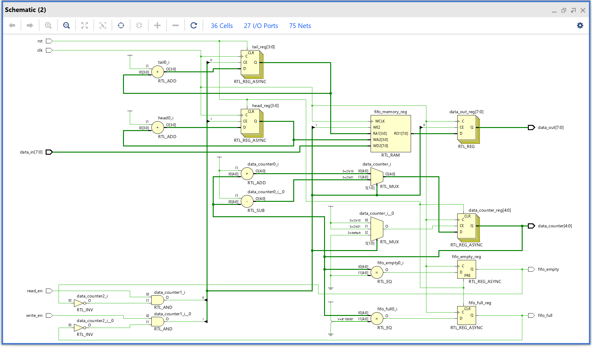
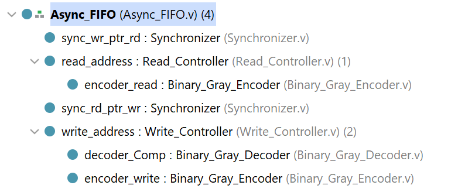
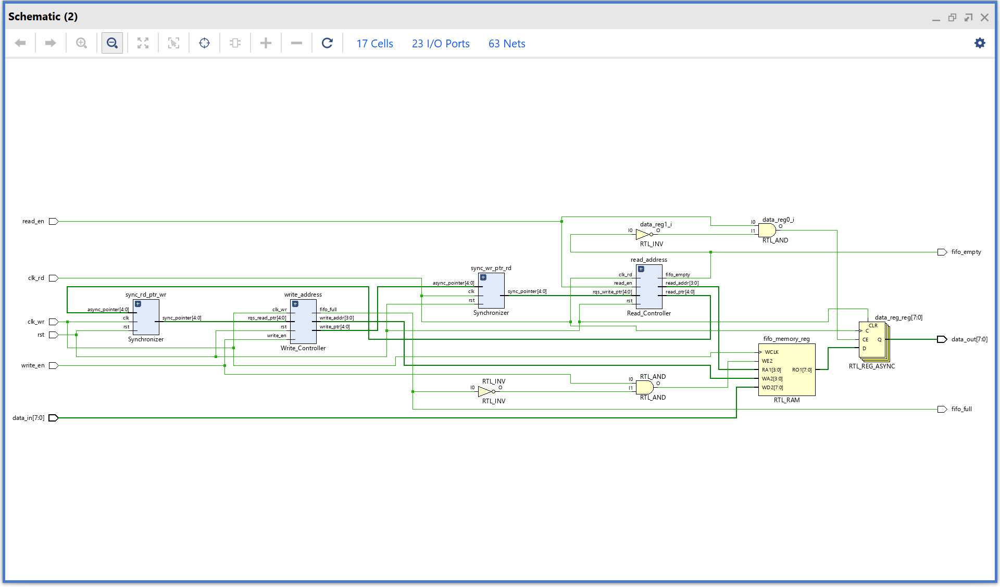

# Synchronous and Asynchronous FIFO in Verilog

---

## 📚 Table of Contents
- [Overview](#overview)
- [Synchronous FIFO](#synchronous-fifo)
  - [Design Description](#design-description-sync)
  - [Waveform](#waveform-sync)
  - [Synthesized Schematic](#synthesized-schematic-sync)
- [Asynchronous FIFO](#asynchronous-fifo)
  - [Design Description](#design-description-async)
  - [Waveform](#waveform-async)
  - [Synthesized Schematic](#synthesized-schematic-async)
- [References](#references)
- [Notes](#notes)

---

## Overview

This project demonstrates the design and verification of two types of FIFOs in Verilog:
- A Synchronous FIFO using a single clock domain
- An Asynchronous FIFO handling two different clock domains

Each design is fully parameterized for:
- Data Width
- FIFO Depth

---

### 🧠 Design Description (Synchronous FIFO) 

The **Synchronous FIFO** operates entirely within a single clock domain and uses a circular buffer structure. It consists of a memory array, two pointers (`read_ptr` and `write_ptr`), and a **counter** that tracks how many data entries are currently stored in the FIFO.

The **counter** is central to managing FIFO status:
- It increments on a valid write operation.
- It decrements on a valid read operation.
- It remains unchanged when both operations happen simultaneously or when neither is valid.

This logic ensures the FIFO never overflows or underflows, while enabling *potential* concurrent read/write support when the FIFO is neither full nor empty.

#### Operation Encoding

| `write_en` | `fifo_full` | `read_en` | `fifo_empty` | Vector | Interpretation                             |
|------------|-------------|-----------|--------------|--------|--------------------------------------------|
| 1          | 0           | 0         | X            | 2'b10  | Write only (counter increments)            |
| 0          | X           | 1         | 0            | 2'b01  | Read only (counter decrements)             |
| 1          | 0           | 1         | 0            | 2'b11  | Write + Read (counter remains the same)    |
| Any        | 1           | Any       | 1            | 2'b00  | No valid operation (counter unchanged)     |

---

### Waveform 

Below is the simulation waveform for the Synchronous FIFO. It demonstrates:
- Sequential writes until the FIFO is full
- Valid read operations after writes
- Correct operation of the `fifo_full` and `fifo_empty` flags

---

### Synthesized Schematic 

This schematic is generated after synthesis using Vivado, showcasing the overall structure of the synchronous FIFO logic.

---

### 🧠 Design Description (Asynchronous FIFO) 

The **Asynchronous FIFO** is designed to allow seamless data transfer between two **independent clock domains.** 

Unlike a synchronous FIFO that shares a single clock, the asynchronous FIFO accepts `write_clk` and `read_clk` separately. This makes it **safe and reliable for clock domain crossing (CDC)**, eliminating the risk of metastability and ensuring data integrity.

#### Key Benefits
- Enables **simultaneous read and write operations**, each governed by its own clock.
- Essential in **clock-domain-crossing applications**, such as communication between processor and peripheral blocks running at different speeds.
- Provides **full** and **empty** flags through synchronized comparisons of pointer values across domains.

---

#### Design Architecture

To manage the complexities of asynchronous operation, the design is modularized into several functional blocks:

1. **Async_FIFO(Top Module)**  
   - A register array used as shared memory for data storage.  
   - Can be accessed concurrently for reading and writing.
   - Responsible for wiring all the submodules.  

2. **Write Controller**  
   - Operates in the `write_clk` domain.  
   - Manages `write_address`, detects FIFO full condition, and controls memory write access.

3. **Read Controller**  
   - Operates in the `read_clk` domain.  
   - Manages `read_address`, detects FIFO empty condition, and handles memory reads.

4. **Gray Code Encoders/Decoders**  
   - Both read and write pointers are **converted to Gray code** before crossing domains.  
   - Gray coding ensures that only one bit changes at a time, minimizing the chance of metastability.

5. **Synchronizers**  
   - Used to safely transfer the Gray-coded pointers between clock domains.  
   - Implemented as **two-stage flip-flop synchronizers** to ensure timing closure and CDC safety.

---

### Waveform 

#### 1. Normal FIFO Operation
The waveform below shows the FIFO being written to until it is full, followed by a sequence of reads after a short delay.  
It verifies:
- Correct assertion of `fifo_full` and `fifo_empty` flags
- Valid data output during reads
- Proper synchronization across two clock domains

---

#### 2. Concurrent Read and Write
This waveform demonstrates simultaneous read and write operations, the primary benefit of asynchronous FIFOs.  
It verifies:
- Concurrent activity in both domains without conflict
- Accurate data handling and FIFO status updates

---

### Synthesized Schematic 

The schematic below is generated post-synthesis using Vivado. It visualizes the key modules involved in the design:

---

## References 

- [Asynchronous FIFO GitHub Repository by Jonathan Jing](https://github.com/JonathanJing/Asynchronous-FIFO/tree/master)  
  This repository provided helpful design patterns and verification insights for asynchronous FIFO implementation.

- [YouTube Video: Asynchronous FIFO - How It Works](https://www.youtube.com/watch?v=0LVHPRmi88c&t=224s)  
  A concise and clear video explaining the logic behind asynchronous FIFOs and the importance of pointer synchronization.

- **ChatGPT Assistance**  
  An initial skeleton testbench for both FIFO types was generated using ChatGPT. It was then customized and extended with specific corner case tests and concurrent read/write scenarios to enhance robustness and realism in simulation.

---

## ✅ Final Notes

- Both designs are fully **synthesizable** and **implementation-ready**, having been tested in Vivado for logic synthesis and RTL schematic generation.

Future testing of the Asynchronous FIFO will include:
- **Timing analysis** across clock domains
- Potential integration into larger digital subsystems involving real clock crossing (e.g., AXI stream interfaces or custom SoCs)

These designs provide a reusable and adaptable foundation for FIFO-based buffering and data-handling architectures in FPGA and ASIC development.

