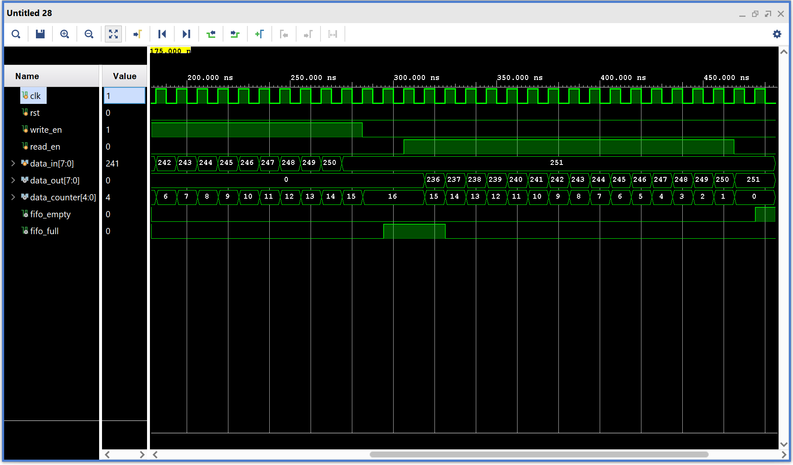

# Synchronous FIFO Implementation in Verilog

This repository contains a parameterized **Synchronous FIFO (First-In, First-Out)** memory module implemented in behavioral Verilog.

## Features

- Fully synchronous operation with respect to the clock (`clk`) and reset (`rst`).
- Parameterized data width (`DATA_WIDTH`) and FIFO depth (`FIFO_DEPTH`).
- Automatic management of FIFO status flags: `fifo_empty` and `fifo_full`.
- Keeps track of the number of stored elements with a `data_counter`.
- Separate pointers for read (`tail`) and write (`head`) operations.
- Handles simultaneous read and write operations correctly.

## Operation Encoding

| write_en | fifo_full | read_en | fifo_empty | Vector | Interpretation       
|----------|-----------|---------|------------|--------|----------------------
| 1        | 0         | 0       | X          | 2'b10  | Write only(counter increments)           
| 0        | X         | 1       | 0          | 2'b01  | Read only(counter decrements)           
| 1        | 0         | 1       | 0          | 2'b11  | Write + Read (counter remains same)        
| Any      | 1         | Any     | 1          | 2'b00  | No valid operation (counter remains same) 

## Usage

The FIFO supports standard FIFO operations:
- **Write:** Data is written on `write_en` when FIFO is not full.
- **Read:** Data is output on `data_out` when `read_en` is asserted and FIFO is not empty.
- `data_counter` provides the current fill level of the FIFO.

> **Note:** The testbench included is *not parameterized*. You will need to manually update the `repeat` parameter and other testbench values according to the FIFO depth and data width settings.

## Output Waveform

## Future Work

- Implementation of an asynchronous FIFO to handle different clock domains(Currently working on it)
- Additional testbenches and verification.
- Possible integration with other modules like UART.

---

Feel free to explore the Verilog source code and provide feedback or contributions.
